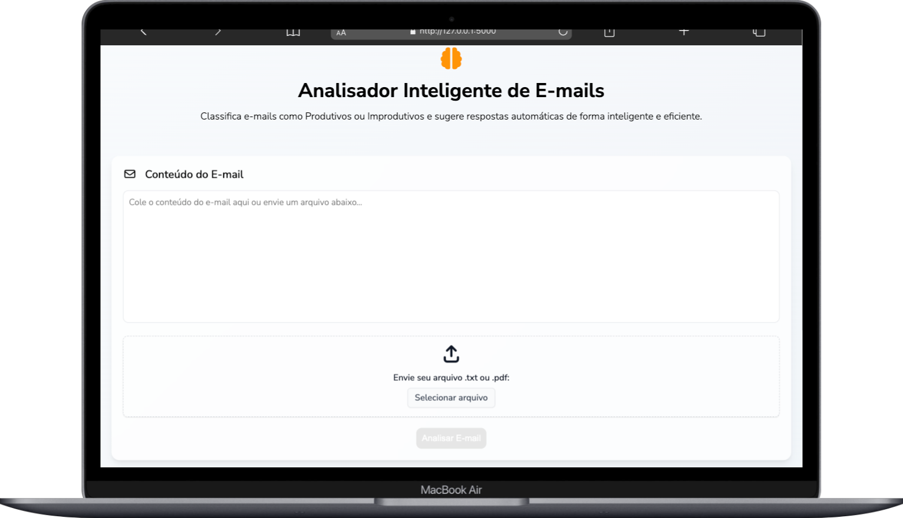
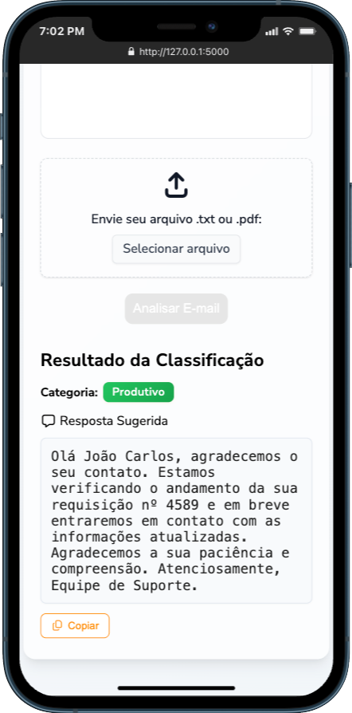

# 🚀 AutoU Email Intelligent Classifier


📌 An intelligent web application for automatic email triage. It classifies emails as "Productive" or "Unproductive" and suggests automated replies using NLP and OpenAI GPT models. Supports .txt and .pdf uploads, advanced preprocessing in Portuguese, and a modern Flask interface.

---

## 📚 Table of Contents

- [🚀 AutoU Email Intelligent Classifier](#-autou-email-intelligent-classifier)
  - [📚 Table of Contents](#-table-of-contents)
  - [📝 About](#-about)
  - [✨ Features](#-features)
  - [🧰 Tech Stack](#-tech-stack)
    - [📦 Core Technologies](#-core-technologies)
  - [🏗️ Architecture](#️-architecture)
    - [🏛️ Backend Architecture](#️-backend-architecture)
    - [🎨 Frontend Architecture](#-frontend-architecture)
    - [🌐 Integration Flow](#-integration-flow)
  - [🖼️ Screenshots](#️-screenshots)
  - [🚀 Getting Started](#-getting-started)
    - [📋 Prerequisites](#-prerequisites)
    - [🔧 Installation](#-installation)
  - [🔌 API Documentation](#-api-documentation)
  - [🧪 Testing](#-testing)
  - [📁 Folder Structure](#-folder-structure)
  - [☁️ Deployment](#️-deployment)
    - [🌐 Live Demo](#-live-demo)
  - [🎯 What I Learned](#-what-i-learned)
  - [🤝 Contributing](#-contributing)
  - [📄 License](#-license)
  - [📬 Contact](#-contact)

---

## 📝 About

AutoU Email Intelligent Classifier is designed for organizations that handle a high volume of emails. It automates the reading, classification, and response suggestion for incoming messages, freeing up teams from repetitive tasks. The system is tailored for Portuguese, but can be adapted for other languages.

---

## ✨ Features

- 📥 Upload and process .txt and .pdf email files
- 📝 Direct email text input
- 🤖 Automatic classification: Productive or Unproductive
- 💬 Automated reply suggestion
- 🗣️ Advanced NLP preprocessing (stopwords removal, lemmatization)
- 🌐 Flask web interface
- 🚀 Ready for cloud deployment

---

## 🧰 Tech Stack

### 📦 Core Technologies

[](https://skillicons.dev)

- **Frontend:** HTML5 / CSS3 (Jinja2 templates)
- **Backend:** Python / Flask
- **NLP:** spaCy / NLTK
- **AI:** OpenAI GPT (gpt-3.5-turbo)
- **PDF Processing:** PyPDF2
- **Deployment:** Render, Hugging Face Spaces, or similar

---

## 🏗️ Architecture

### 🏛️ Backend Architecture
```
┌───────────────┐    ┌───────────────┐    ┌───────────────┐
│   Flask App   │ -> │  NLP Pipeline │ -> │ OpenAI Client │
│ (HTTP Layer)  │    │ (Preprocess)  │    │ (Classification/Reply)
└───────────────┘    └───────────────┘    └───────────────┘
```

### 🎨 Frontend Architecture
```
┌───────────────┐    ┌───────────────┐
│   Jinja2      │ -> │   HTML/CSS    │
│  Templates    │    │   (UI/UX)     │
└───────────────┘    └───────────────┘
```

### 🌐 Integration Flow
```
User Input (.txt/.pdf/text) -> Flask Route -> Preprocessing (spaCy/NLTK) -> OpenAI GPT -> Classification & Reply -> Web UI
```

---

## 🖼️ Screenshots

| Home (Upload) | Result |
|---------------|--------|
|  |  |

---

## 🚀 Getting Started

### 📋 Prerequisites

- Python >= 3.9
- pip
- Git
- OpenAI API Key

### 🔧 Installation

```bash
# Clone the repository
git clone https://github.com/Fransuelton/test-auto-u-email-classifier.git

# Navigate to the folder
cd test-auto-u-email-classifier

# Install dependencies
pip install -r requirements.txt

# Download spaCy Portuguese model
python -m spacy download pt_core_news_sm

# Set your OpenAI API key
export OPENAI_API_KEY="your-api-key-here"

# Run the application
python main.py
```

---

## 🔌 API Documentation

- `/process` (POST): Process email text or file and return classification and reply (web form)
- `/api/classify` (POST): JSON API for classification
- `/api/emails` (GET): List mock emails
- `/api/emails/<id>` (GET): Get mock email by ID
- `/api/health` (GET): Health check

---

## 🧪 Testing

Manual testing via the web interface and API endpoints. (Automated tests can be added as needed.)

---

## 📁 Folder Structure

```bash
test-auto-u-email-classifier/
├── main.py                 # Main Flask application
├── utils.py               # Utility functions (NLP, OpenAI, PDF processing)
├── requirements.txt       # Python dependencies
├── Procfile              # Deployment configuration
├── README.md             # Project documentation
├── routes/               # Flask routes
│   ├── __init__.py
│   ├── main_routes.py    # Web interface routes
│   └── api_routes.py     # API endpoints
├── templates/            # HTML templates
│   └── index.html
├── static/               # Static assets
│   ├── styles/          # CSS files
│   ├── scripts/         # JavaScript files
│   └── assets/          # Images and icons
└── examples/             # Sample email files
    ├── email_improdutivo.txt
    ├── email_improdutivo.pdf
    ├── email_produtivo.txt
    └── email_produtivo.pdf
```

---

## ☁️ Deployment

- Deployable to Render, Hugging Face Spaces, Vercel, or any cloud platform supporting Python/Flask.
- Set the `OPENAI_API_KEY` environment variable before running.

### 🌐 Live Demo
- **Render:** [https://test-auto-u-email-classifier.onrender.com/](https://test-auto-u-email-classifier.onrender.com/)

---

## 🎯 What I Learned

- **NLP Integration**: How to integrate NLP preprocessing with AI APIs for real-world automation
- **File Processing**: Handling file uploads and PDF extraction in Flask applications
- **AI Engineering**: Prompt engineering for reliable AI classification and reply generation
- **Security**: Best practices for environment variables and API key security
- **Code Organization**: Structuring Flask applications with blueprints and modular design
- **Bilingual Development**: Maintaining English code standards while supporting Portuguese content

---

## 🤝 Contributing

Contributions are welcome! Please open an issue or submit a pull request.

---

## 📄 License

This project is licensed under the MIT License. See the [LICENSE](./LICENSE) file for details.

---

## 📬 Contact

**Fransuelton Francisco**  
📫 contato@fransuelton.dev  
🌐 [fransuelton.dev](https://fransuelton.dev)  
🐙 [github.com/Fransuelton](https://github.com/Fransuelton)  
💼 [linkedin.com/in/fransuelton](https://www.linkedin.com/in/fransuelton)

---

⭐️ If you found this project useful, please consider leaving a star!